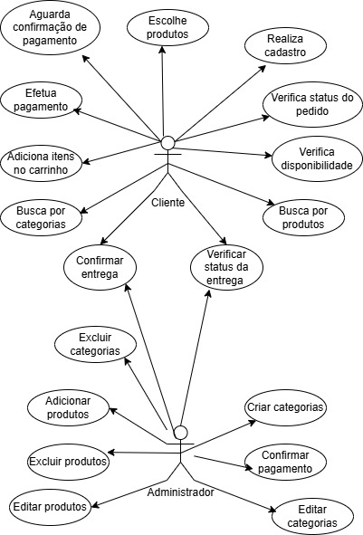
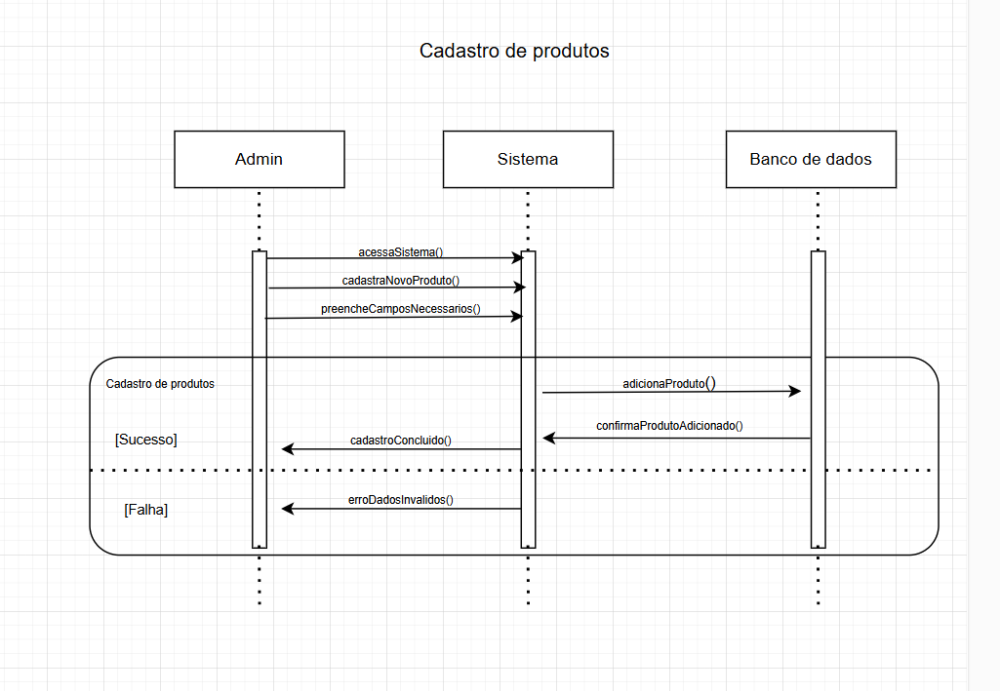
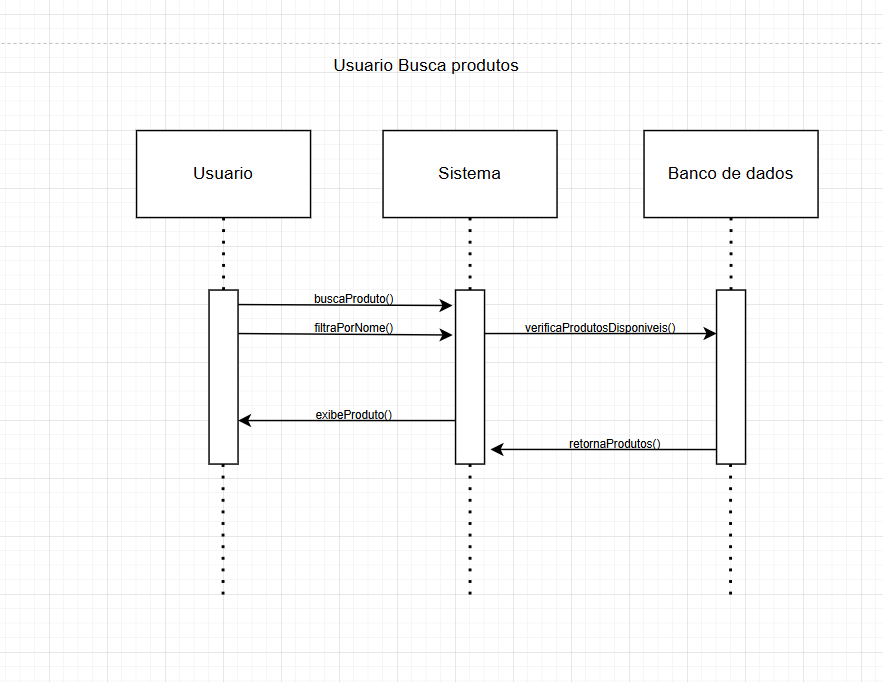
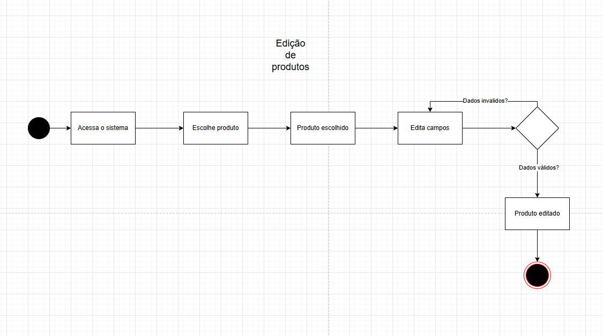
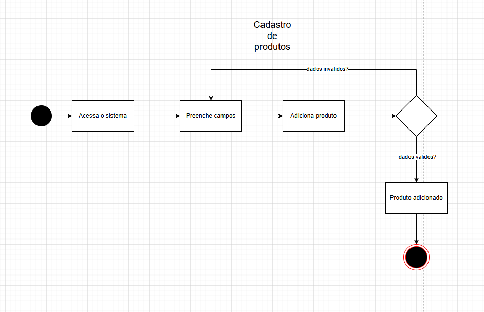
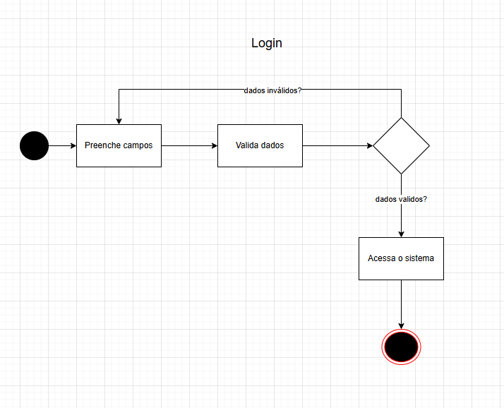
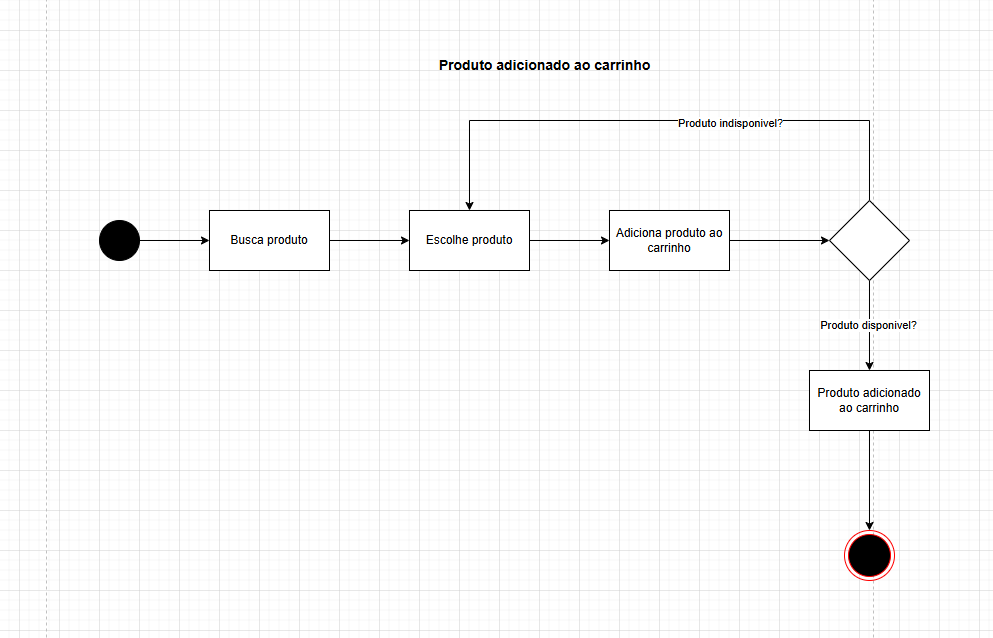
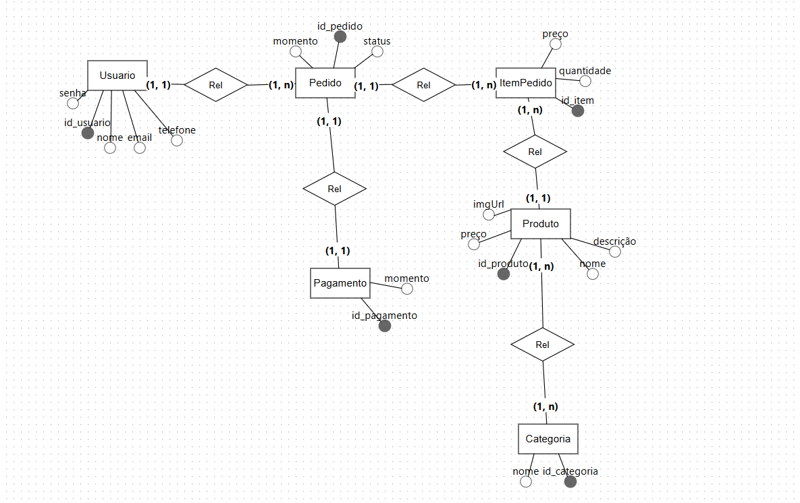

# E-commerce

## Descrição do Projeto
Este projeto consiste em uma API de Marketplace, onde é possivel:

- Adicionar produtos, clientes, categorias, pagamento
- Remover produtos, clientes, categorias
- Editar produtos, categorias, pagamento
- Realizar pagamento

## Tecnologias Utilizadas
- **Java 17**
- **Spring Boot**
  - Spring Web
  - Spring Data JPA
- **PostgreSQL** (Banco de dados relacional)
- **JPA/Hibernate** (Mapeamento objeto-relacional)
- **H2** 

## Funcionalidades
- Cadastro de usuários 
- Gerenciamento de produtos
- Pesquisa e filtro de produtos
- Solicitação de pagamento

---

## Padrões de projetos


| Padrão            | Tipo        | Onde aparece                                                                 |
|-------------------|-------------|------------------------------------------------------------------------------|
| Composite         | Estrutural  | Relação entre `Order` e `OrderItem`.                                         |
| Adapter           | Estrutural  | Uso de `@JsonIgnore` para serialização JSON.                                 |
| Facade            | Estrutural  | Classes de serviço (`UserService`, `OrderService`, etc.).                    |
| Singleton         | Criacional  | Beans gerenciados pelo Spring (`@Service`, `@Repository`, etc.).             |
| Factory Method    | Criacional  | Uso de `Optional` em métodos como `findById`.                                |
| Builder           | Criacional  | Uso de `ServletUriComponentsBuilder` para construir URIs.                    |


---

## UML do Projeto

### Documento de visão: 

<a href="docs/Documento de Visão - ecommerce.pdf">Clique aqui para acessar</a>


### Consistência de diagramas
 <a href="docs/consistencia-diagramas.pdf">Clique aqui para acessar</a>

### Abaixo estão os diagramas UML do sistema:

### Diagrama de Classes


### Diagrama de Caso de Uso


### Diagrama de Sequência



### Diagrama de Atividades





---

## Modelagem Banco de Dados




---
## Cronograma do Projeto
| Fase | Atividades | Prazo |
|------|-----------|-------|
| **Fase 1** | Levantamento de requisitos e modelagem UML | 1 semana |
| **Fase 2** | Configuração do ambiente e banco de dados | 1 semana |
| **Fase 3** | Desenvolvimento do backend (API REST) | 3 semanas |
| **Fase 4** | Implementação de segurança e autenticação | 2 semanas |
| **Fase 5** | Testes, documentação e refinamento | 2 semanas |
| **Fase 6** | Apresentação e entrega final | 1 semana |

---
## Como Rodar o Projeto
### Pré-requisitos
Certifique-se de ter instalado:
- **Java 17**
- **PostgreSQL**

### Passos para executar
1. Clone o repositório:
   ```bash
   git clone https://github.com/mateustomaz1/marketplace.git
   cd marketplace-servicos
   ```
2. Configure o banco de dados PostgreSQL e ajuste o `application.properties`:
   ```properties
   spring.datasource.url=jdbc:postgresql://localhost:5432/marketplace
   spring.datasource.username=seu_usuario
   spring.datasource.password=sua_senha
   ```
3. Execute a aplicação:
   ```bash
   ./mvnw spring-boot:run
   ```
---
## Autores

- <a src="https://www.linkedin.com/in/klebsonamarante/">Klebson Amarante</a>
<br>
- <a src="https://www.linkedin.com/in/mateus-tomaz-270b30204/">Mateus Tomaz</a>
<br>
- <a src="https://www.linkedin.com/in/guilhermee-santos/">Guilherme Santos</a>
