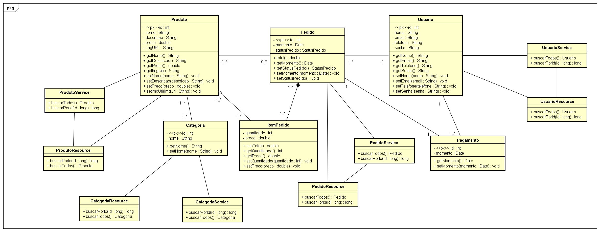

# Marketplace Project

## Descrição do Projeto
Este projeto consiste em um Marketplace de Serviços, onde prestadores de serviços podem se cadastrar e oferecer seus serviços para clientes interessados. O sistema permite a busca, avaliação e contratação de serviços, proporcionando uma interface intuitiva e segura para ambas as partes.

## Tecnologias Utilizadas
- **Java 17**
- **Spring Boot**
  - Spring Web
  - Spring Data JPA
- **PostgreSQL** (Banco de dados relacional)
- **JPA/Hibernate** (Mapeamento objeto-relacional)
- **Swagger/OpenAPI** (Documentação da API)
- **H2** (Redução de boilerplate code)

## Funcionalidades
- Cadastro e autenticação de usuários (cliente e prestador de serviço)
- Publicação e gerenciamento de serviços
- Pesquisa e filtro de serviços
- Solicitação de serviço e pagamento
- Sistema de avaliação e feedback
- Painel administrativo para gerenciamento

---


## UML do Projeto
Abaixo estão os diagramas UML do sistema:

### Diagrama de Classes


### Diagrama de Caso de Uso


### Diagrama de Sequência


### Diagrama de Estado


### Diagrama de Atividades


---
## Cronograma do Projeto
| Fase | Atividades | Prazo |
|------|-----------|-------|
| **Fase 1** | Levantamento de requisitos e modelagem UML | 1 semana |
| **Fase 2** | Configuração do ambiente e banco de dados | 1 semana |
| **Fase 3** | Desenvolvimento do backend (API REST) | 3 semanas |
| **Fase 4** | Implementação de segurança e autenticação | 2 semanas |
| **Fase 5** | Testes, documentação e refinamento | 2 semanas |
| **Fase 6** | Apresentação e entrega final | 1 semana |

---
## Como Rodar o Projeto
### Pré-requisitos
Certifique-se de ter instalado:
- **Java 17**
- **PostgreSQL**

### Passos para executar
1. Clone o repositório:
   ```bash
   git clone https://github.com/mateustomaz1/marketplace.git
   cd marketplace-servicos
   ```
2. Configure o banco de dados PostgreSQL e ajuste o `application.properties`:
   ```properties
   spring.datasource.url=jdbc:postgresql://localhost:5432/marketplace
   spring.datasource.username=seu_usuario
   spring.datasource.password=sua_senha
   ```
3. Execute a aplicação:
   ```bash
   ./mvnw spring-boot:run
   ```
4. Acesse a documentação da API no Swagger:
   ```
   http://localhost:8080/swagger-ui.html
   ```
---
## Autores

- <a src="https://www.linkedin.com/in/klebsonamarante/">Klebson Amarante</a>
<br>
- <a src="https://www.linkedin.com/in/mateus-tomaz-270b30204/">Mateus Tomaz</a>
<br>
- <a src="https://www.linkedin.com/in/guilhermee-santos/">Guilherme Santos</a>